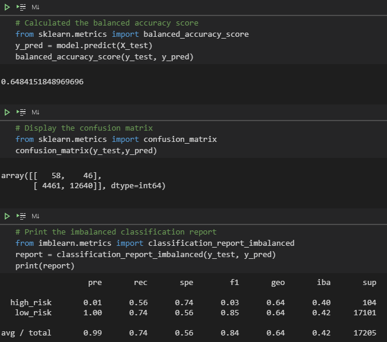

# Credit Risk Analysis

## Overview of the Analysis

The task was to employ different techniques to train and evaluate models with unbalanced classes using the imbalanced-learn and scikit-learn libraries to build and evaluate models using resampling. Using the credit dataset from LendingClub, a peer-to-peer lending services the task was to oversample the data using the RandomOverSampler and SMOTE algorithms, and undersample the data using the ClusterCentroids algorithm.

## Resources

- Data Source: LoanStats_2019Q1.csv
- Software: Visual Studio Code 1.52.1, Atom 1.53.0 x64

## Results

#### Random Over Sampler

- Balanced accuracy score: 57.4%
- A high risk precision at 1%, a recall value of 43% connected to a f-score of 2%
- A low risk precision at 100%, a recall value of 71% connected to a f-score of 83%

#### SMOTE

- Balanced accuracy score: 64.8%
- A high risk precision at 1%, a recall value of 56% connected to a f-score of 3%
- A low risk precision at 100%, a recall value of 74% connected to a f-score of 84%

#### Cluster Centroids

- Balanced accuracy score: 64.8%
- A high risk precision at 1%, a recall value of 50% connected to a f-score of 1%
- A low risk precision at 99%, a recall value of 54% connected to a f-score of 69%

#### SMOTEENN

- Balanced accuracy score: 65.8%
- A high risk precision at 1%, a recall value of 64% connected to a f-score of 2%
- A low risk precision at 99%, a recall value of 67% connected to a f-score of 80%.

#### Balanced Random Forest Classifier

- Balanced accuracy score: 76.7%
- A high risk precision at 3%, a recall value of 64% connected to a f-score of 7%
- A low risk precision at 100%, a recall value of 89% connected to a f-score of 94%.

#### Easy Ensemble Classifier

- Balanced accuracy score: 91.8%
- A high risk precision at 9%, a recall value of 89% connected to a f-score of 16%
- A low risk precision at 100%, a recall value of 94% connected to a f-score of 96%.

## Summary

It is clear from the results that the EasyEnsembleClassifier and BalancedRandomForestClassifier had better accuracy and precision than randomOverSampling, SMOTE, ClusterCentroids and SMOTEENN. The EasyEnsembleClassifier had the best high risk precision and recall values.
